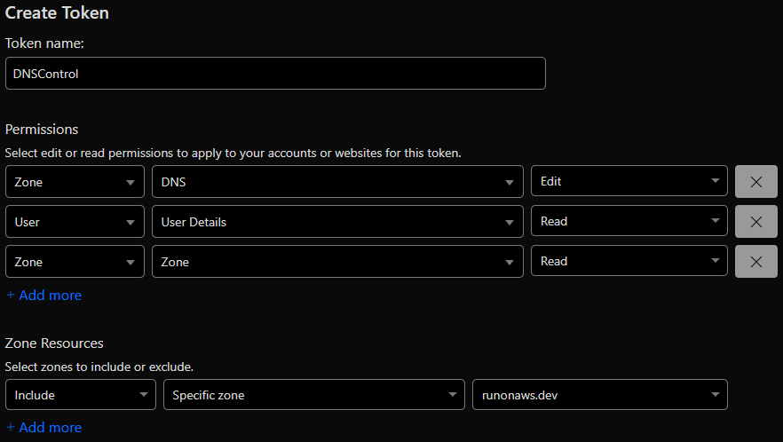

# Cloudflare-DNSControl

## Security Policy: Root Domain Record Management

**Important:**

- Only CAA records are managed as code at the root domain (apex) via DNSControl. All other root-level records (A, AAAA, MX, NS, TXT, etc.) are ignored and must be managed directly in the Cloudflare panel.
- The only CAA records currently allowed are for certificate authorities: letsencrypt.org, amazon.com, amazontrust.com, awstrust.com, and amazonaws.com.
- Subdomain requests and changes are managed via DNSControl and Pull Requests (PRs) for auditability and process control.
- Any changes to other root-level DNS configurations require Cloudflare panel access and written approval. No developer, operations, or platform team member may modify root-level DNS records without explicit authorization.

**Summary:**

- Only CAA records for approved certificate authorities are managed as code at the root domain.
- All other root-level DNS records are ignored by DNSControl and require manual management in Cloudflare.
- Subdomain management is handled via PRs and DNSControl.

## Ignored DNS Records in DNSControl

| Pattern                       | Type      | Purpose/Reason                                      | Security/Risk if not Ignored                       |
|-------------------------------|-----------|-----------------------------------------------------|----------------------------------------------------|
| `*`                           | A         | Ignore all wildcard A records                        | Wildcard A records can expose all subdomains to unintended IPs, risking takeover or misrouting. |
| `*._domainkey`                | TXT       | Ignore all DKIM TXT records for subdomains           | DKIM records are managed by mail providers; accidental changes can break email authentication. |
| `@`                           | * (except CAA) | Ignore all records at the root domain except CAA     | Only CAA records for approved CAs are managed as code. All other root records are critical and must be managed manually. |
| `_acme-challenge`             | TXT       | Ignore ACME challenge TXT records (SSL certs)        | SSL certificate issuance can fail or be hijacked if these are modified. |
| `_discord`                    | TXT       | Ignore Discord verification TXT records              | Discord integrations may break or be hijacked.      |
| `_dmarc`                      | TXT       | Ignore DMARC TXT records                             | DMARC policy changes can impact email deliverability and security. |
| `_psl`                        | TXT       | Ignore Public Suffix List TXT records                | Public Suffix List changes can impact domain security and browser behavior. |
| `ns[1-4]`                     | A,AAAA    | Ignore name server A/AAAA records                    | Name server records are critical; accidental changes can break DNS resolution for the entire domain. |

> The following steps are informational and describe the underlying tools used in the repo. All team members the Dev, Ops, Platform, and AI teams should fork the repository or create a branch (e.g., `dns/<team-name>-subdomain-name`), add your `subdomain.json` file to the `domains` folder, and submit a pull request with the required details. No additional steps are necessary.

## DNSControl Quick Install

Manage DNS as code with [DNSControl](https://github.com/StackExchange/dnscontrol/releases).

### Install (Fedora/RHEL)

```bash
curl -LO https://github.com/StackExchange/dnscontrol/releases/download/v4.24.0/dnscontrol-4.24.0.x86_64.rpm
sudo dnf install ./dnscontrol-4.24.0.x86_64.rpm -y
```

### Verify Installation

```bash
dnscontrol version
# Output: 4.24.0
```

### Other Platforms
- macOS
- Debian
- Windows
- FreeBSD

See [DNSControl Releases](https://github.com/StackExchange/dnscontrol/releases) for downloads.

## Cloudflare API Creation and Validation



To verify your Cloudflare API token, run:

```bash
curl "https://api.cloudflare.com/client/v4/user/tokens/verify" \
     -H "Authorization: Bearer XX-YOUR-CF-TOKEN-XX"
```
Example successful response:
```json
{
  "success": true,
  "errors": [],
  "messages": [
    {
      "code": 10000,
      "message": "This API Token is valid and active",
      "type": null
    }
  ],
  "result": {
    "id": "1A2B3C4D5E6F7G8H9I",
    "status": "active",
    "not_before": "2025-08-31T00:00:00Z", // If you have set a TTL/Expiry
    "expires_on": "2025-10-01T23:59:59Z" // ^^
  }
}
```

